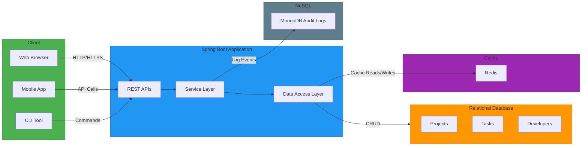

# Project Tracker System Architecture

## High-Level Diagram

# Components Breakdown
### 1. Client Layer:
- **Web Browser**: React/Angular/Vue.js frontend.
- **Mobile App**: iOS/Android clients.
- **CLI Tool**:  For developers/automation (e.g., curl/scripts).

### 2. Spring Boot Application:
- **REST APIs**: Expose endpoints for clients.
- **Service Layer**: Business logic (e.g., project/task management).
- **Data Access Layer**:  Handles database interactions.

### 3. Databases:
| Component           | Technology  | Purpose                          |
|---------------------|-------------|----------------------------------|
| Relational Database | PostgreSQL  | Stores projects, tasks, developers |
| Redis        |Redis | Caches frequent queries/results |
| MongoDB            | MongoDB  | Audit logs (immutable records)|

## Data Flow

1. **Clients** → `REST APIs` (HTTP/HTTPS or CLI commands)
2. **REST APIs** → `Service Layer` (business logic)
3. **Service Layer** → `Data Access Layer` (DB interactions)
4. **Data Access Layer** → Writes/reads from:
    - **RelationalDB** (Projects/Tasks/Developers)
    - **Redis** (cache hot data)
5. **Service Layer** → Logs events to **MongoDB** (audit trail)

---

## How to Render

- Paste the Mermaid code into any Markdown editor (e.g., GitHub/GitLab/VSCode)
- For live previews, use:
    - [Mermaid Live Editor](https://mermaid.live/)
    - VS Code with [Mermaid extension](https://marketplace.visualstudio.com/items?itemName=bierner.markdown-mermaid)

---

## Customization Tips

- **Add Cloud Icons**: Use `:aws-s3:` or `:azure:` for cloud services
- **Security Layer**: Insert an `API Gateway` or `Auth Service` box
- **Deployment**: Add `Docker/Kubernetes` containers if applicable